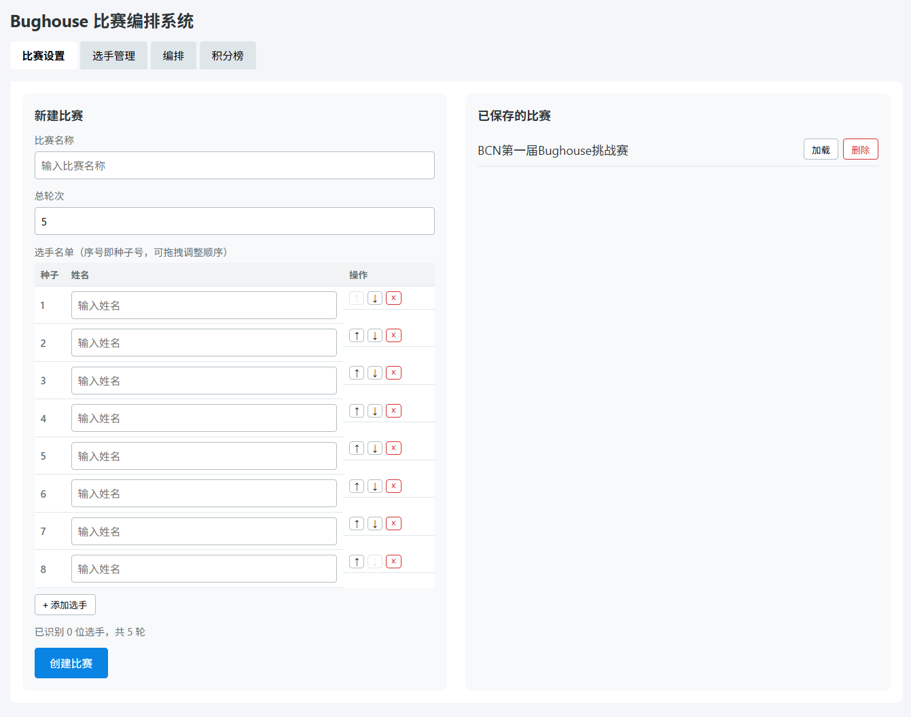
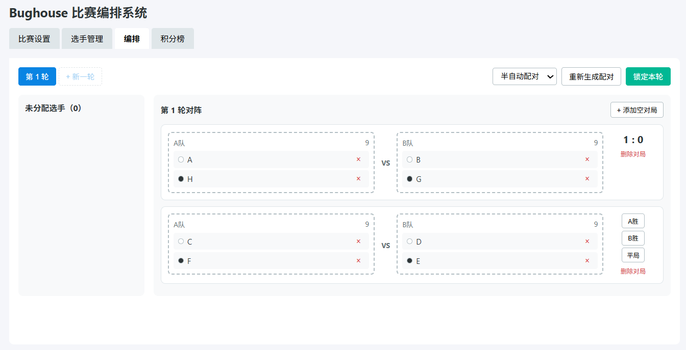
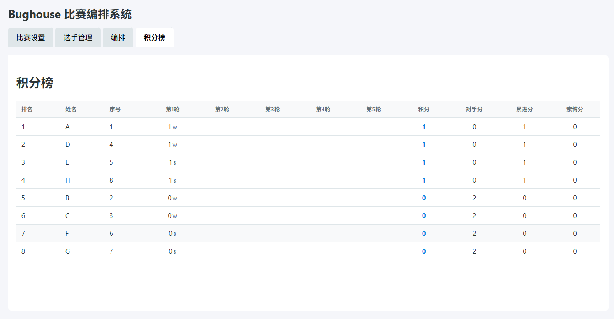

# Bughouse 比赛编排系统

面向线下 Bughouse 联棋比赛的单机编排工具，支持选手录入、瑞士制风格自动配对、手动微调、结果录入、积分榜和破同分排名。

## 预览

### 比赛设置



### 对阵编排



### 积分榜



## 功能

- 创建和加载本地比赛
- 录入选手并按种子顺序排序
- 自动生成 Bughouse 对阵，兼顾队友轮换、高低搭配、积分接近和颜色平衡
- 支持人工调整对阵
- 录入胜、负、和结果
- 自动计算积分、对手分、累进分和索博分

比赛编排采用适配 Bughouse 联棋的瑞士制编排。选手以个人身份参赛，每轮系统会重新组成双人队伍并安排对阵。

每轮配对会综合考虑以下因素：

尽量避免重复队友。重复队友会被极力避免，但在人数较少或轮次较多时，系统可能被迫安排重复队友。
尽量高低搭配。种子号较高与较低的选手会优先组成队伍，使每队实力更均衡。
尽量让两队总实力接近。系统会比较两队种子号组合，优先安排实力接近的队伍对阵。
尽量让积分接近的队伍相遇。系统优先考虑两队当前总积分接近，同时也会参考队内个人积分差。
尽量避免连续执同色。系统会参考上一轮执白/执黑情况，尽量轮换颜色。
尽量减少重复遇到同一位对手。此项为低优先级，不会优先于队友轮换、实力平衡和积分接近。
在多个方案接近时，系统会使用可复现的轻微打散规则，避免固定模式。
每轮比赛结果按队伍记录，并计入两名队员的个人积分：

胜：1 分
平：0.5 分
负：0 分
个人排名依次按照以下规则决定：

总积分
对手分 Buchholz
累进分 Progressive
索博分 Sonneborn-Berger
种子号
对手分、累进分和索博分用于区分同分选手。比赛结束后，以最终个人排名确定名次。

English

This event uses a Swiss-style pairing system adapted for Bughouse. Players enter as individuals. In each round, the system forms new two-player teams and pairs those teams against each other.

Pairings are based on the following priorities:

Avoid repeated teammates as much as possible. Repeated teammates are strongly discouraged, but may occur if the player pool or number of rounds makes it unavoidable.
Prefer mixed-strength teams. Higher-seeded and lower-seeded players are more likely to be paired together to keep teams balanced.
Keep team strength close. The system compares the combined seed strength of both teams and prefers balanced matchups.
Keep scores close. Teams with similar total scores are preferred, with individual score spread used as a secondary factor.
Avoid repeated colors when possible. The system considers each player’s previous color and tries to alternate white/black assignments.
Reduce repeated individual opponents. This is a low-priority factor and does not override teammate rotation, team balance, or score proximity.
When multiple options are very close, a small reproducible tie-break is used to avoid fixed pairing patterns.
Each round result is recorded by team and applied to both players on that team:

Win: 1 point
Draw: 0.5 points
Loss: 0 points
Individual standings are ranked by:

Total score
Buchholz
Progressive score
Sonneborn-Berger
Seed number
Buchholz, Progressive score, and Sonneborn-Berger are used as tie-breaks between players with the same total score. Final individual standings determine the event results.

## 本地运行

```powershell
npm install
npm run dev
```

## 浏览器版构建

```powershell
npx vite build
```

构建产物位于 `dist/`，可部署到任意静态网站服务。
