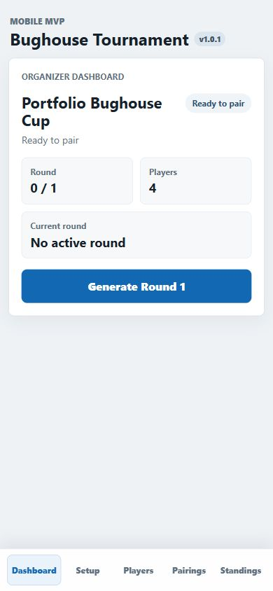
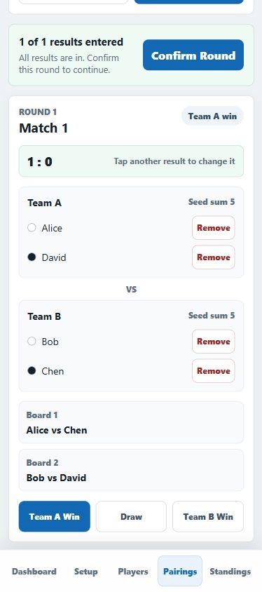
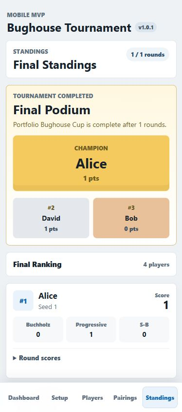

# Bughouse Tournament Mobile MVP

A mobile-first tournament management MVP for complex pairing, scoring, standings, and result workflows.

This is not just a UI redesign. It is a mobile-first transformation of a rule-based tournament workflow: player intake, automated pairing, touch-friendly result entry, live standings, tie-break calculation, and final podium presentation.

## Screenshots

| Dashboard | Pairings + Results | Final Podium |
| --- | --- | --- |
|  |  |  |

## Project Background

Bughouse is a two-player-team chess variant where tournament organization is more complex than a simple singles bracket. Players enter as individuals, but every round forms new teams, assigns colors, records team results, and converts those results back into individual standings.

The goal of this project is to demonstrate how a niche offline tournament process can become a practical mobile-first organizer tool. The workflow is highly transferable to snooker leagues, chess events, pool leagues, darts leagues, and local club competitions.

## Problem

Local tournament organizers often need to run events from a phone while standing beside players. A desktop-style table interface is hard to use in that setting.

The organizer needs to:

- Add players quickly.
- Generate pairings.
- Review the current round.
- Enter results from match cards.
- See live standings.
- Confirm final rankings and podium results.

The hard part is not only layout. The hard part is preserving rule logic while making the workflow state-driven and touch-friendly.

## Solution

This MVP keeps the existing Vue web stack and local-first storage, then adds a mobile app shell and mobile-specific screens under `src/mobile/`.

The app now guides a single organizer through:

1. Dashboard status and next action.
2. Player roster management.
3. Round generation.
4. Pairing cards.
5. Result entry inside each pairing card.
6. Live standings with tie-breaks.
7. Final podium when the tournament is complete.

## Mobile MVP Scope

Included:

- Mobile-first dashboard.
- Bottom navigation.
- Player cards with seed, score, edit, delete, and reseed controls.
- Pairing cards for each match.
- Touch-friendly result buttons.
- Round completion and confirmation states.
- Standings cards with Buchholz, Progressive, and Sonneborn-Berger.
- Final podium display.
- PWA-ready metadata through Vite PWA.
- Local IndexedDB persistence.

Intentionally not included:

- Login or user accounts.
- Online matchmaking.
- Cloud sync.
- Push notifications.
- Payments.
- Native mobile app packaging.
- Multi-role permissions.
- Backend API.

## Core Organizer Flow

The MVP is designed around a single role: Tournament Organizer.

```text
Setup
-> Add/manage players
-> Generate round
-> Review pairings
-> Enter results
-> Confirm round
-> View standings
-> Complete tournament
-> View final podium
```

The dashboard derives the next primary action from tournament state instead of showing every possible button at once.

## Core Logic

The pairing and scoring logic is preserved from the original project.

Core files:

- `src/domain/pairingEngine.ts` - pairing generation, history tracking, scoring, validation, tie-break calculations.
- `src/domain/types.ts` - Tournament, Player, Round, Match, Team, Board, and result types.
- `src/stores/tournament.ts` - Pinia store for tournament state and actions.
- `src/db/database.ts` - Dexie/IndexedDB local persistence.

Pairing priorities include:

- Avoid repeated teammates where possible.
- Prefer balanced high/low seed team composition.
- Keep team scores and seed strength close.
- Reduce repeated individual opponents.
- Consider color history.
- Apply deterministic tie-break noise when options are close.

Standings are ranked by:

1. Total score.
2. Buchholz.
3. Progressive score.
4. Sonneborn-Berger.
5. Seed number.

## Architecture Notes

The mobile transformation is intentionally incremental.

- Existing business logic remains in `src/domain/`.
- Existing persistence remains local through Dexie.
- New mobile-first UI lives in `src/mobile/`.
- Legacy desktop-oriented components are kept in `src/components/` as reference while the MVP is migrated.
- No backend or authentication layer is introduced.

## Tech Stack

- Vue 3
- TypeScript
- Pinia
- Dexie / IndexedDB
- Vite
- vite-plugin-pwa
- Electron packaging config retained from the original project

## Run Locally

```powershell
npm install
npm run dev
```

## Build

```powershell
npm run build
```

The production build is generated in `dist/`.

## Transferability To League Matchmaking Apps

This project maps closely to mobile MVPs for snooker leagues, pool leagues, darts leagues, chess clubs, and other local competition tools.

The transferable product patterns are:

- Player ranking or seeding.
- Matchmaking/pairing rules.
- Result entry.
- Result confirmation.
- Season or tournament standings.
- Promotion/final ranking logic.
- Organizer-first mobile workflow.

That makes this project a useful portfolio case for complex-rule MVP delivery, not just visual frontend work.
